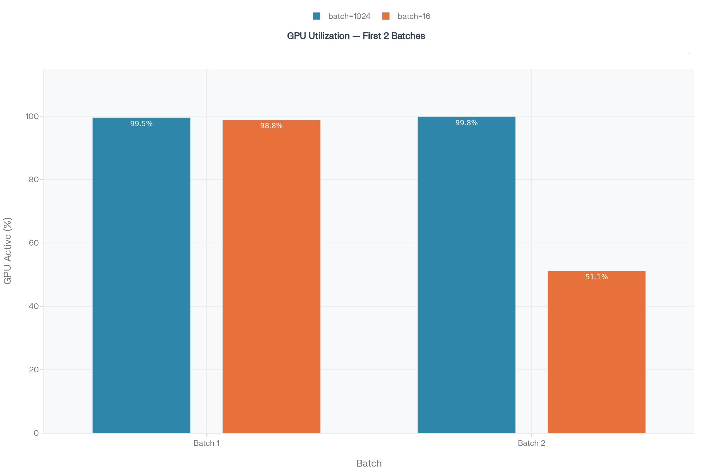
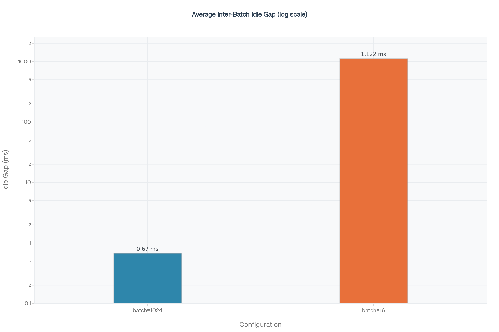
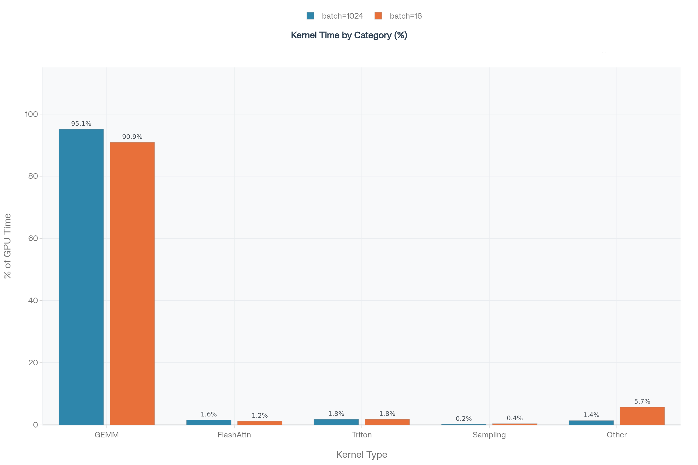

# Nsight Systems Profiling Results

This directory contains GPU execution traces and analysis for two batch size configurations of Llama3.1-8B:
- `batch=1024`
- `batch=16`

All runs were profiled against the same 13,368-sample MLPerf Offline workload on a single NVIDIA H200 NVL GPU using vLLM v0.17.1. Each run was stopped after two complete batches; all figures are derived from the Nsight Systems SQLite trace files.

## Key Findings

- The model is compute-bound (95.1% GEMM at batch=1024, 90.9% at batch=16)
- Batch size 1024 wastes only 0.002% of GPU time idle (0.516 ms gap)
- Batch size 16 wastes 50% of GPU time idle (1,121.7 ms gap)
- "Other" overhead grows from 1.4% to 5.7% of GPU active time at batch=16
- FlashAttention efficiency drops from 1.6% to 1.2% at batch=16

## Complete Data Table

| Metric                                     | batch=1024 Batch 1 | batch=1024 Batch 2 | batch=16 Batch 1 | batch=16 Batch 2 |
|--------------------------------------------|--------------------|--------------------|------------------|------------------|
| Wall time (s)                              | 24.111             | 27.437             | 1.093            | 1.104            |
| GPU active time (s)                        | 24.002             | 27.379             | 1.080            | 0.564            |
| GPU utilisation (%)                        | 99.5               | 99.8               | 98.8             | 51.1             |
| Kernel count                               | 111,242            | 111,682            | 54,965           | 24,602           |
| Avg kernel duration (ms)                   | 0.216              | 0.245              | 0.020            | 0.023            |
| Inter-batch idle gap (avg, ms)             | 0.516              | 0.516              | 1,121.7          | 1,121.7          |
| Inter-batch idle gap (% of batch time)     | 0.002%             | 0.002%             | 50%              | 50%              |
| GEMM % of GPU active time                  | 95.1%              | 95.1%              | 90.9%            | 90.9%            |
| Triton/Elementwise % of GPU active time    | 1.8%               | 1.8%               | 1.8%             | 1.8%             |
| FlashAttention % of GPU active time        | 1.6%               | 1.6%               | 1.2%             | 1.2%             |
| Other (overhead) % of GPU active time      | 1.4%               | 1.4%               | 5.7%             | 5.7%             |
| Sampling/TopK % of GPU active time         | 0.2%               | 0.2%               | 0.4%             | 0.4%             |
| KV cache % of GPU active time              | 0.0%               | 0.0%               | 0.0%             | 0.0%             |
| Occurrences of decode kernel (Batch 1)     | 33,024             | 33,024             | 16,256           | 16,256           |
| Avg decode step interval (ms)              | 0.729              | 0.729              | 0.058            | 0.058            |
| Implied tokens per request (Batch 1)       | 32.2               | 32.2               | 32.0             | 32.0             |

## Key Ratios

- **Inter-batch gap ratio**: batch=16 idle gap is 2,174× larger than batch=1024 (1,121.7 ms vs 0.516 ms)
- **Utilisation ratio**: batch=1024 utilisation is 99.5–99.8% vs batch=16 51.1% (roughly 2× higher)
- **Step interval ratio**: batch=1024 step intervals are 12.6× longer than batch=16 (0.729 ms vs 0.058 ms)

## Graphics

### GPU Utilisation Over Time

GPU utilisation across the first two batches for each configuration. batch=16 drops to 51.1% on Batch 2, exposing sustained CPU-side idle time between batches.

### Inter-Batch Idle Gap

Average inter-batch idle gap on a log scale. batch=16 idles for 1,122 ms on average between batches, 2,174 times longer than the 0.516 ms observed at batch=1024.

### Kernel Category Utilisation

Kernel category utilisation as a percentage of total GPU active time for batch=1024 (left) and batch=16 (right). GEMM dominates in both cases, but the Other category grows from 1.4% to 5.7% at batch=16, and FlashAttention efficiency drops from 1.6% to 1.2%.

## Files

- `1024_nsys_report.nsys-rep` — Nsight Systems trace for batch=1024
- `16_nsys_report.nsys-rep` — Nsight Systems trace for batch=16
- `nsys_gpu_util.png` — GPU utilization plot across batches
- `nsys_interbatch.png` — Inter-batch idle gap visualization
- `nsys_kernel_cat.png` — Kernel category utilization by batch size
