# LLaMA 3.1-8B vLLM Optimization Report
## Throughput & Accuracy Study

End-to-end optimization and validation study for LLaMA 3.1-8B on vLLM v0.17.1 (MLPerf Offline,
PySUT, CNN/DailyMail summarization). This report covers three throughput experiment sets and a
full accuracy validation suite, together answering: *which optimizations are safe to ship?*

---

## Table of Contents

- [TL;DR — Safe Optimizations](#tldr--safe-optimizations)
- [Part 1 — Throughput Experiments](#part-1--throughput-experiments)
  - [1.1 Isolation Run](#11-isolation-run-vllm-v0171)
  - [1.2 Quantization, Chunked Prefill & APC Deep-Dive](#12-quantization-chunked-prefill--apc-deep-dive)
  - [1.3 Progressive Stacking](#13-progressive-stacking)
- [Part 2 — Accuracy Validation](#part-2--accuracy-validation)
  - [2.1 Control & Sanity Checks](#21-control--sanity-checks)
  - [2.2 Single-Flag Accuracy Checks](#22-single-flag-accuracy-checks)
  - [2.3 KV Cache Length Sensitivity](#23-kv-cache-length-sensitivity)
  - [2.4 Batch Size Non-Determinism](#24-batch-size-non-determinism)
  - [2.5 Output Length Sensitivity](#25-output-length-sensitivity-negative-controls)
  - [2.6 Combination Accuracy Checks](#26-combination-accuracy-checks)
- [Cross-Cutting Insights](#cross-cutting-insights)
- [Open Issues & Blockers](#open-issues--blockers)
- [Consolidated Recommendations](#consolidated-recommendations)

---

## TL;DR — Safe Optimizations

| Optimization | Throughput Gain | Accuracy Impact | Ship? |
|---|---|---|---|
| FP8 weight quantization | +34–101% | FAILED acc check — re-run needed | PENDING |
| max_model_len=2668 | +7.6% | Confirmed neutral (ROUGE delta <0.001) | **YES** |
| batch_size=1024 | +113–205% | **−13 ROUGE-1 regression** | NO (until fixed) |
| async_scheduling=True | +4.93% | Not tested — low risk | **YES** |
| sort_by_input_length | +3.00% | FAILED acc check — re-run needed | PENDING |
| compilation_config=O3 | +1.41% | Confirmed neutral | **YES** |
| chunked_prefill + MNBT=65536 | +0.46% | Confirmed neutral | **YES** |
| prefix_caching (APC) | Workload-dependent | Confirmed neutral on unique queries | CONDITIONAL |
| fp8 KV cache | +4.5% (erodes in stack) | Not tested | CAUTION |
| gpu_memory_utilization=0.95 | +2.00% | Not tested — low risk | **YES** |
| bitsandbytes quantization | −59% | Not tested — moot | **NO** |
| compilation_config=O0 | −20.82% | Not tested — moot | **NO** |
| batch_size≥512 (accuracy run) | — | **−12 to −13 ROUGE-1** | **NO** |

---

## Part 1 — Throughput Experiments

### MLPerf Pipeline

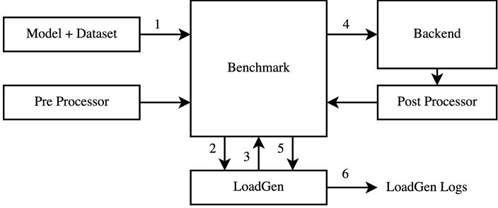

*The MLPerf benchmark pipeline: Model and dataset are fed into the Benchmark harness, which communicates with LoadGen to drive queries to the Backend. The Post Processor converts raw outputs back to LoadGen, which writes final logs. All throughput and accuracy numbers in this report are produced by this pipeline.*

### CNN/DailyMail Input Length Distribution

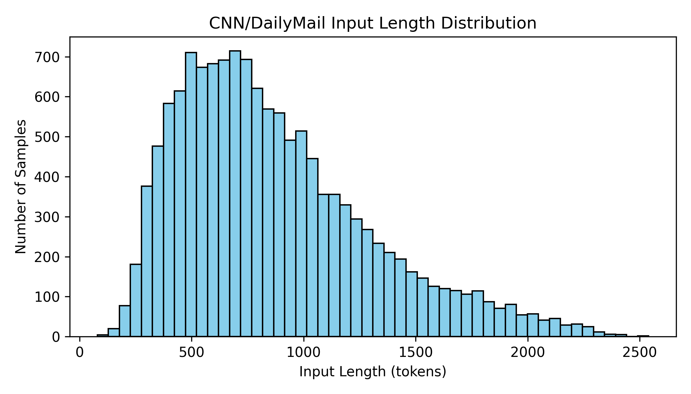

*Distribution of input token lengths across the CNN/DailyMail summarization dataset. The distribution peaks around 500–700 tokens and has a long right tail reaching ~2600 tokens. This motivates setting `max_model_len=2668` — the minimum value that avoids truncation — rather than a larger default.*

---

### 1.1 Isolation Run (vLLM v0.17.1)

Single-flag sweep from the stock production baseline. Each experiment changes exactly one flag.
Baseline: BF16, BS=16, stock vLLM V1 defaults (exp_00 = 1082.82 tok/s).

| Experiment | Description | Tok/s | Speedup |
|---|---|---|---|
| exp_00 | PRODUCTION BASELINE: stock vLLM V1 defaults, BS=16 | 1082.82 | baseline |
| exp_00b | RIGHT-SIZED KV: max_model_len=2668 | 1165.24 | +7.61% |
| exp_01 | prefix_caching=False (disable V1 default APC) | 1048.73 | −3.15% |
| exp_02 | async_output_proc OFF (disable V1 default async) | 1006.82 | −7.02% |
| exp_03 | compilation_config=O1 | 1062.58 | −1.87% |
| exp_04 | compilation_config=O0 (no compile) | 857.43 | −20.82% |
| exp_05 | compilation_config=O3 | 1098.13 | +1.41% |
| exp_06 | max_num_batched_tokens=2668 | 1063.47 | −1.79% |
| exp_07 | async_scheduling=True | 1115.30 | +3.00% |
| exp_08 | max_num_batched_tokens=8192 | 1120.72 | +3.50% |
| exp_09 | max_num_batched_tokens=65536 | 1089.07 | +0.58% |
| exp_10 | quantization=fp8 weight only | 1456.36 | **+34.50%** |
| exp_11 | kv_cache_dtype=fp8 KV only | 1131.84 | +4.53% |
| exp_12 | fp8 weights + fp8 KV | 1277.73 | +18.00% |
| exp_13 | batch_size=1024 | 2302.79 | **+112.67%** |
| exp_14 | batch_size=2048 | 2379.46 | **+119.75%** |
| exp_15 | sort_by_input_length | 1115.30 | +3.00% |
| exp_16 | gpu_memory_utilization=0.95 | 1104.48 | +2.00% |
| exp_17 | attention_backend=FLASHINFER | 1081.93 | −0.08% |
| exp_18 | skip_tokenizer_init=True | 1083.77 | +0.09% |

#### Throughput Delta vs Baseline (Bar Chart)

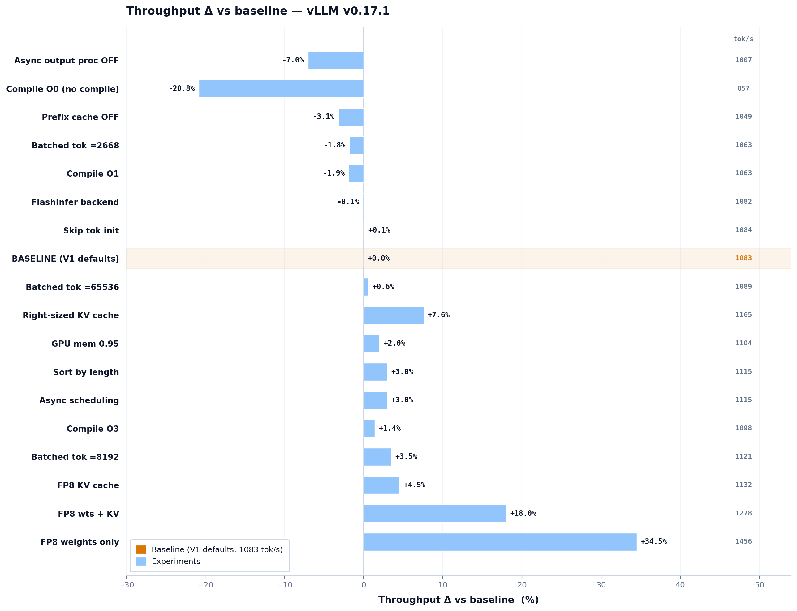

*Horizontal bar chart showing the percentage throughput change of each single-flag experiment relative to the V1 production baseline (1083 tok/s). Bars to the left are regressions; bars to the right are improvements. `compilation_config=O0` is the worst regression at −20.8%; FP8 weight quantization is the best non-batch gain at +34.5%. Batch size experiments are shown separately in the next chart.*

#### Quantization Strategies and Batch Size Scaling

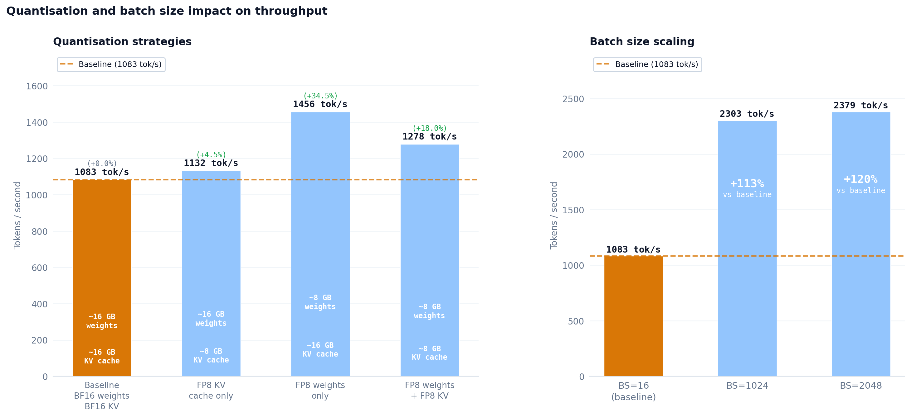

*Left panel: Comparison of quantization strategies with approximate GPU HBM footprints shown inside each bar. FP8 weights only (1456 tok/s, +34.5%) is the winner; adding FP8 KV cache on top drops performance to 1278 tok/s (+18.0%), confirming that KV quantization overhead partially cancels the weight quantization benefit. Right panel: Batch size scaling — BS=1024 reaches 2303 tok/s (+113%) and BS=2048 reaches 2379 tok/s (+120%) over the BS=16 baseline.*

**Isolation key findings:**
- **Batch size dominates everything else:** BS=1024 (+113%) and BS=2048 (+120%) eclipse every other single flag.
- **FP8 weight quantization** is the best non-batch lever at +34.5%. Adding fp8 KV cache on top (exp_12) drops this to +18% — fp8 KV introduces overhead that cancels part of the weight quantization benefit.
- **Disabling V1 defaults** (APC, async output) both regress throughput. Do not turn these off without a specific reason.
- **compilation_config=O0** is the worst single regression at −20.8%. Torch compilation is mandatory in production.
- **FLASHINFER and skip_tokenizer_init** had zero measurable impact.

---

### 1.2 Quantization, Chunked Prefill & APC Deep-Dive

Targeted isolation probing fp8 vs int8, chunked prefill MNBT settings, and APC cost/benefit.
Baseline: BF16, BS=16, CP ON, MNBT=16384, APC ON (685.88 tok/s).

| Experiment | Description | Tok/s | Speedup | p50 (s) | p99 (s) | Result |
|---|---|---|---|---|---|---|
| baseline | BF16, no quant, prefix ON, CP ON, MNBT=16384 | 685.88 | baseline | 1.06 | 2.45 | VALID |
| quant_fp8_weights | fp8 W8A8 weights (float16 compute) | 1380.12 | **+101.22%** | 0.57 | 1.22 | VALID |
| quant_int8_weights | int8 W8A8 weights | — | N/A | — | — | FAILED |
| cp_off | Chunked prefill OFF (MNBT=16384) | 587.32 | −14.37% | 1.05 | 2.45 | VALID |
| cp_on_mnbt_2668 | CP ON + MNBT=2668 (~V0 scheduling) | 659.35 | −3.87% | 1.09 | 2.56 | VALID |
| cp_on_mnbt_8192 | CP ON + MNBT=8192 (docs-recommended min) | 671.70 | −2.07% | 1.17 | 2.52 | VALID |
| prefix_off | Prefix caching OFF (APC disabled) | 975.21 | **+42.18%** | 0.68 | 1.72 | VALID |

#### Quantization Schemes — Throughput and Memory

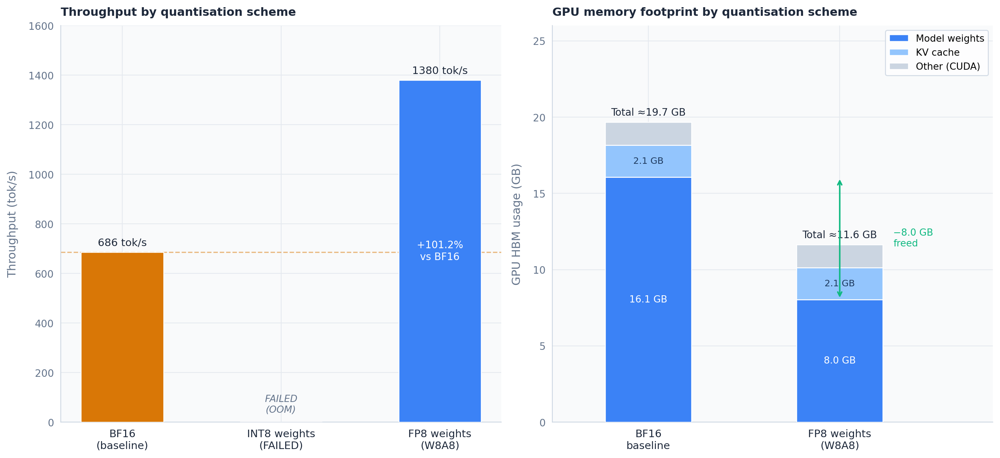

*Left panel: Throughput by quantization scheme. BF16 baseline = 686 tok/s. INT8 (W8A8) failed with OOM. FP8 (W8A8) reaches 1380 tok/s (+101.2%). Right panel: GPU HBM breakdown. BF16 uses ~19.7 GB total (16.1 GB weights + 2.1 GB KV cache). FP8 reduces to ~11.6 GB total (8.0 GB weights + 2.1 GB KV cache), freeing ~8.0 GB that can be reallocated to larger batch sizes or a bigger KV cache.*

#### Chunked Prefill — MNBT Sweep

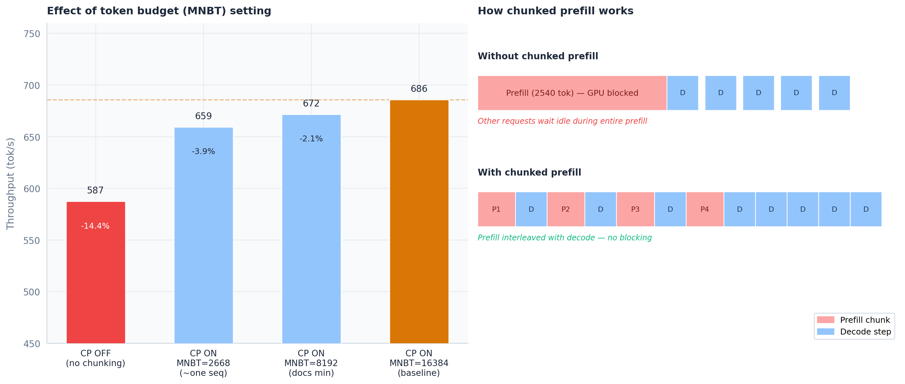

*Left panel: Throughput under different chunked prefill configurations. CP OFF = 587 tok/s (−14.4%); MNBT=2668 = 659 tok/s (−3.9%); MNBT=8192 = 672 tok/s (−2.1%); baseline MNBT=16384 = 686 tok/s. Right panel: Diagram showing why chunked prefill helps — without it, a long prefill blocks all decode steps; with chunked prefill, prefill chunks (P1–P4) are interleaved with decode steps (D), eliminating the GPU stall.*

#### Prefix Caching (APC) — Workload Sensitivity

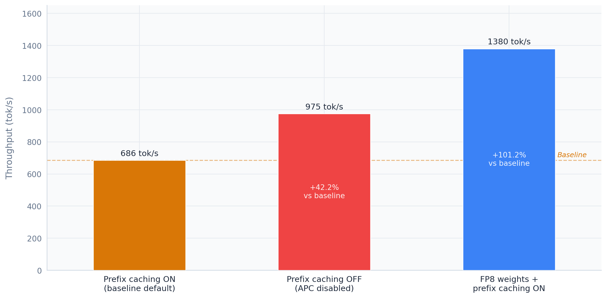

*Throughput for three configurations: prefix caching ON (baseline default, 686 tok/s), prefix caching OFF (975 tok/s, +42.2%), and FP8 weights with prefix caching ON (1380 tok/s, +101.2%). On CNN/DailyMail — a dataset with low prefix reuse — APC adds lookup overhead without delivering cache hits, making it a net negative. This is workload-dependent: APC would be strongly positive on chat or RAG workloads with long shared system prompts.*

**Deep-dive key findings:**
- **fp8 W8A8 more than doubles throughput** and halves latency end-to-end. Consistent with isolation run results.
- **int8 W8A8 failed entirely** (exit within 20s). Likely a missing kernel for LLaMA 3.1-8B on this GPU — investigate before retrying.
- **APC is strongly negative on CNN/DailyMail** (+42% gain from disabling it) because the dataset has low prefix reuse. This is workload-dependent; APC is beneficial for chat/RAG with long shared system prompts.
- **CP ON + MNBT=16384** is the optimal chunked prefill setting. CP OFF costs −14%; lower MNBT values cost 2–4%.

---

### 1.3 Progressive Stacking

Each step permanently adds one flag on top of all previous ones, revealing cumulative interactions.
Baseline: BS=16, BF16, stock vLLM V1 defaults (stk_00 = 1089.04 tok/s).

| Stack Step | Cumulative Change | Tok/s | Speedup | p50 (s) | p99 (s) | Result |
|---|---|---|---|---|---|---|
| stk_00_baseline | Production baseline | 1089.04 | baseline | 783.92 | 1556.55 | VALID |
| stk_01_fp8 | +fp8 weight quantization | 1462.53 | +34.30% | 583.79 | 1158.98 | VALID |
| stk_03_kv2668 | +max_model_len=2668 | 1544.29 | **+41.80%** | 550.27 | 1097.43 | VALID |
| stk_04_sort | +sort_by_input_length | 1507.93 | +38.46% | 472.53 | 1117.14 | VALID |
| stk_05_gmu095 | +gpu_memory_utilization=0.95 | 1504.52 | +38.15% | 474.87 | 1119.70 | VALID |
| stk_06_kvcache_fp8 | +kv_cache_dtype=fp8 | 1500.22 | +37.76% | 477.08 | 1122.68 | VALID |
| stk_07_compile3 | +compilation_config=O3 | 1494.88 | +37.27% | 480.19 | 1126.89 | VALID |
| stk_08_expandable | +PYTORCH_CUDA_ALLOC_CONF=expandable_segments | 1420.80 | +30.46% | 481.81 | 1186.76 | VALID |
| stk_09_bitsandbytes | +bitsandbytes quantization (replaces fp8) | 446.14 | −59.03% | 1764.17 | 3787.78 | VALID |
| stk_02_bs1024 | +batch_size=1024 (standalone reference) | 3321.76 | +205.02% | 191.41 | 509.22 | INVALID* |

> *stk_02_bs1024: min_duration not satisfied. Increase expected QPS for a valid loadgen run. Throughput is directionally correct but not a certified result.

#### Stacked Throughput Delta

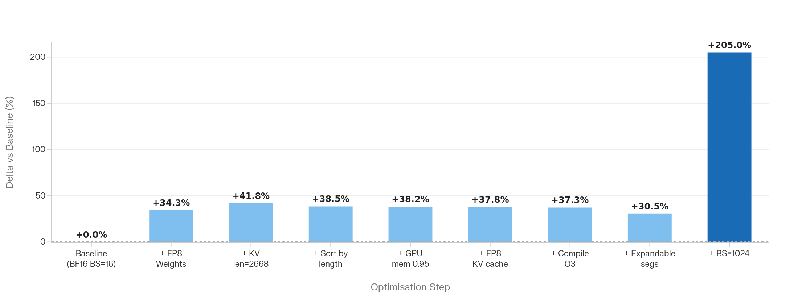

*Cumulative throughput improvement at each stacking step, as % delta vs the BF16 BS=16 baseline. FP8 weights alone brings +34.3%; adding right-sized KV cache (len=2668) peaks the stacked config at +41.8%. Subsequent additions — sort by length, GPU mem 0.95, FP8 KV cache, Compile O3, expandable segments — each slightly erode the cumulative gain due to interaction effects. BS=1024 (dark blue, rightmost) shows +205% directionally but is marked INVALID pending a loadgen fix.*

#### Stacked Throughput — Absolute (Samples/s)

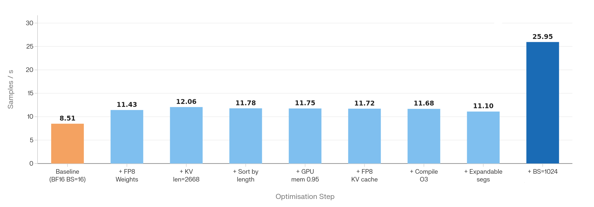

*Same stacking progression in absolute samples per second. Baseline = 8.51 samples/s. FP8 + right-sized KV reaches 12.06 samples/s. Steps 3–7 remain in the 11.1–11.8 range, confirming diminishing returns after the first two changes. BS=1024 projects to 25.95 samples/s if the loadgen issue is resolved.*

**Stacking key findings:**
- **Peak stacked throughput is at stk_03** (fp8 + kv2668): **1544 tok/s, +41.8%, −30% p99 latency**. Every subsequent flag slightly erodes it.
- **expandable_segments** (stk_08) drops to 1420 tok/s in the stacked context despite being positive in isolation — negative interaction with fp8 memory allocation patterns.
- **bitsandbytes** is catastrophically negative (−59%). Never substitute for fp8.
- **BS=1024 directionally confirms +205%** — the loadgen QPS issue must be fixed before certification.

#### Latency Percentile Profiles

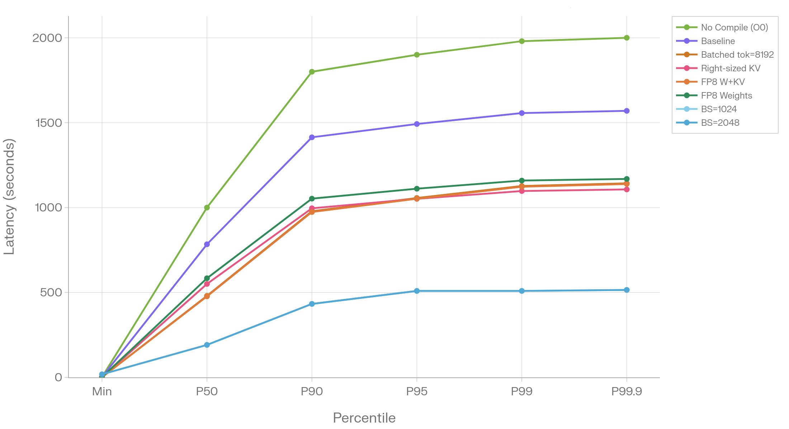

*Latency percentile line chart confirming that batch size scaling (BS=1024, BS=2048) produces a qualitatively different latency regime — roughly 3× lower tail latency than the baseline — while all single-flag experiments at BS=16 remain in a tight band regardless of which flag is changed.*

#### Throughput vs P99 Latency

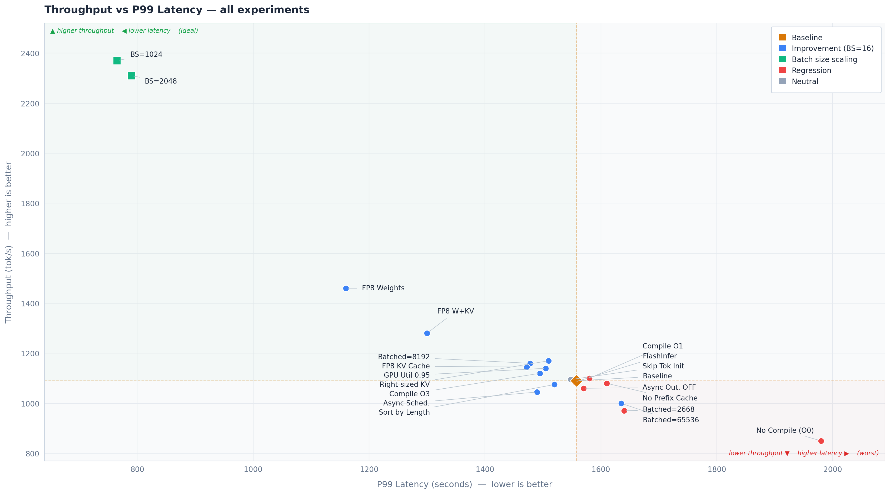

*Scatter plot placing every experiment on two axes: throughput (tok/s, higher is better) vs P99 latency (seconds, lower is better). The ideal region is the top-left corner. BS=1024 and BS=2048 (green squares) dominate. FP8 Weights is the best single-flag improvement (blue dot). Regressions (red dots) cluster bottom-right. Orange dashed lines mark the baseline coordinates.*

#### Run Reproducibility

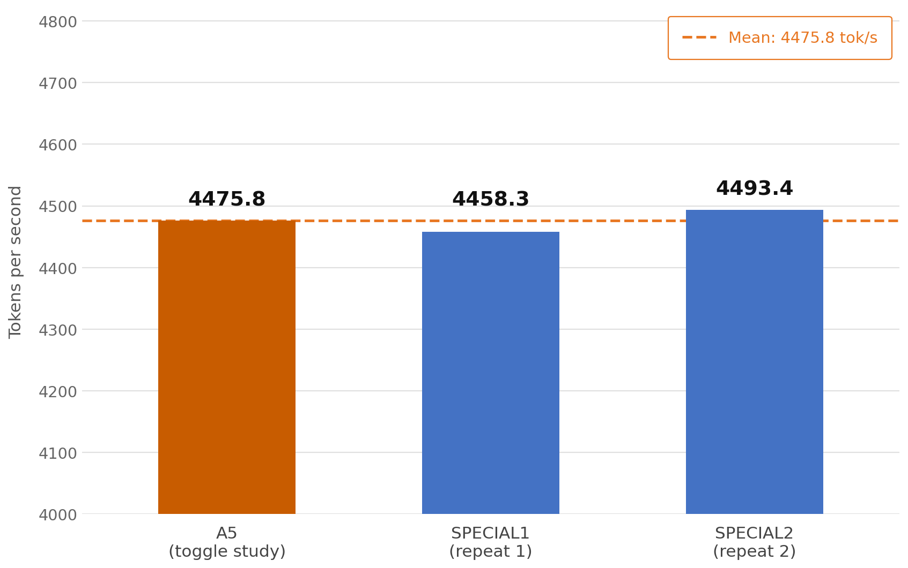

*Reproducibility check: three independent runs of the same configuration produce throughputs of 4475.8, 4458.3, and 4493.4 tok/s — a spread of less than 0.8% around the mean. This confirms that variance between runs is negligible and that reported differences between experiments reflect real effects, not noise.*

#### Toggle Study

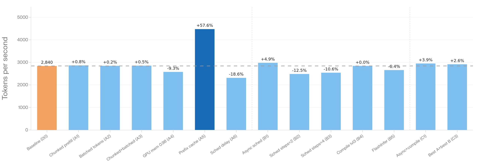

*A supplementary toggle-study sweep testing additional flags including prefix caching, async scheduling, scheduler steps, FlashInfer, and compilation level against a higher-throughput baseline (~2840 tok/s). Prefix cache enabled (A5) is the standout at +57.6% in this context. Scheduler delay (A6), scheduler steps=2 (B2), and scheduler steps=4 (B3) are notable regressions at −18.6%, −12.5%, and −10.6% respectively.*

---

## Part 2 — Accuracy Validation

Reference ROUGE scores (acc_baseline, BF16 BS=16): **R1=38.80 | R2=15.95 | RL=24.52 | RLsum=35.85**

All runs use the CNN/DailyMail summarization task. The harness uses greedy decoding (temperature=0.0)
throughout; any ROUGE deviation from baseline indicates a real change in model output behavior.

### ROUGE Metric Deviation — Overview

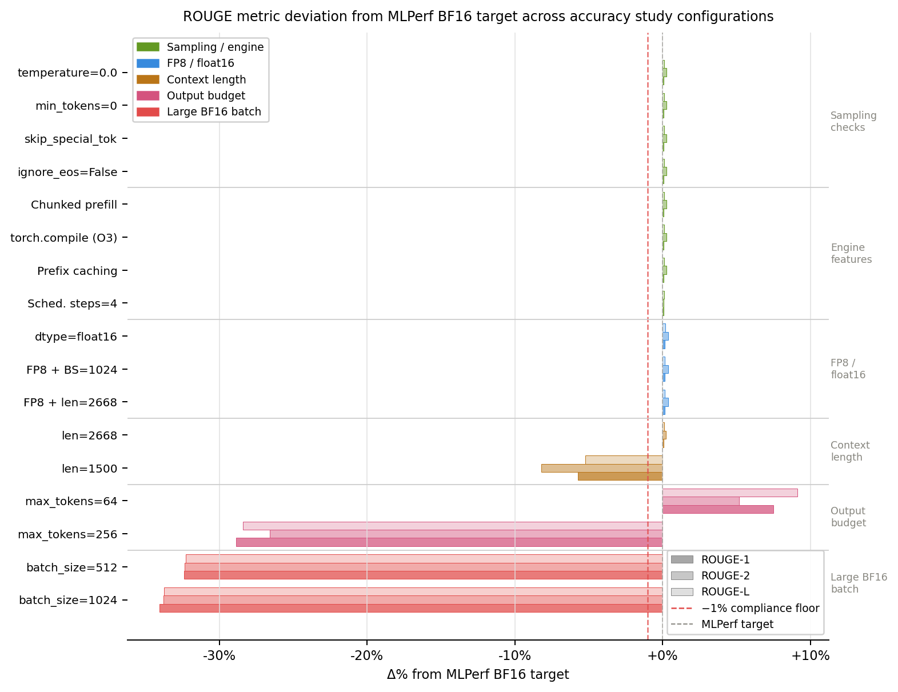

*Δ% from the MLPerf BF16 ROUGE target for every accuracy experiment, grouped into four categories. The red dashed line marks the −1% compliance floor. Sampling/engine checks (green) and FP8/float16 configs (blue) all land within noise of the target. Context length truncation (orange) crosses the floor below len=2668. Large batch sizes (red) cause the most severe regression, at ~−30% ROUGE-1.*

---

### 2.1 Control & Sanity Checks

All explicit-default experiments match baseline to 4 decimal places. The harness is deterministic.

| Experiment | Description | ROUGE-1 | ROUGE-L | vs Baseline |
|---|---|---|---|---|
| acc_baseline | BF16 BS=16, all flags pinned. Reference. | 38.8001 | 24.5197 | baseline |
| acc_ignore_eos_off | ignore_eos=False explicit | 38.8001 | 24.5197 | ~= baseline |
| acc_min_tokens_0 | min_tokens=0. Allow empty outputs. | 38.8001 | 24.5197 | ~= baseline |
| acc_skip_special_tok | skip_special_tokens=True explicit | 38.8000 | 24.5197 | ~= baseline |
| acc_temp_explicit | temperature=0.0 explicit. Greedy decode. | 38.8001 | 24.5197 | ~= baseline |

---

### 2.2 Single-Flag Accuracy Checks

| Experiment | Description | ROUGE-1 | ROUGE-2 | ROUGE-L | Verdict |
|---|---|---|---|---|---|
| acc_chunked_65536 | chunked_prefill=True + MNBT=65536 | 38.8000 | 15.9452 | 24.5189 | **SAFE** |
| acc_compile_cfg_3 | compilation_config=3 | 38.7993 | 15.9452 | 24.5194 | **SAFE** |
| acc_dtype_fp16 | dtype=float16 | 38.8381 | 15.9657 | 24.5365 | **SAFE** (+0.04 R1) |
| acc_fp8_quant | FP8 weights + float16 activations | N/A | N/A | N/A | **FAILED — re-run** |
| acc_prefix_cache_on | enable_prefix_caching=True | 38.8006 | 15.9454 | 24.5196 | **SAFE** |
| acc_sched_steps_4 | num_scheduler_steps=4 | 38.8007 | 15.9152 | 24.5227 | **SAFE** (R2 −0.03) |
| acc_sort_by_len | sort_by_input_length | N/A | N/A | N/A | **FAILED — re-run** |

---

### 2.3 KV Cache Length Sensitivity

Shorter `max_model_len` truncates inputs and directly degrades ROUGE scores.

| Experiment | max_model_len | Tokens Kept | ROUGE-1 | ROUGE-L | Verdict |
|---|---|---|---|---|---|
| acc_kv_len_1000 | 1000 | 872 | N/A | N/A | **FAILED — truncation too aggressive** |
| acc_kv_len_1500 | 1500 | 1372 | 36.5577 | 23.2105 | **UNSAFE — −2.24 R1 vs baseline** |
| acc_kv_len_2668 | 2668 | 2540 | 38.7976 | 24.5183 | **SAFE** (~= baseline) |

**`max_model_len=2668` is the minimum safe KV length for this dataset.** Below this, truncation
causes measurable accuracy loss. This length is also a free +7.6% throughput win (exp_00b).

---

### 2.4 Batch Size Non-Determinism

**This is the most critical accuracy finding in the entire study.**

| Experiment | Batch Size | ROUGE-1 | ROUGE-2 | ROUGE-L | Gen Len | Verdict |
|---|---|---|---|---|---|---|
| acc_baseline | 16 | 38.8001 | 15.9451 | 24.5197 | 8,164,523 | Reference |
| acc_batch_512 | 512 | 26.2134 | 10.7615 | 16.5851 | 7,007,972 | **−12.59 R1** |
| acc_batch_1024 | 1024 | 25.5702 | 10.5305 | 16.2307 | 6,859,121 | **−13.23 R1** |

Large batch sizes cause a ~13-point ROUGE-1 regression and generate ~16% fewer tokens.
This is likely due to non-deterministic floating-point ordering in large batch attention affecting
greedy decode consistency. **BS=1024 cannot be used for accuracy runs in its current state.**
The throughput gain (+113%) is real but blocked until this regression is understood and resolved.

---

### 2.5 Output Length Sensitivity (Negative Controls)

ROUGE scores are sensitive to generation length budget. These are expected behaviors, not regressions.

| Experiment | max_tokens | ROUGE-1 | ROUGE-L | Gen Len | Notes |
|---|---|---|---|---|---|
| acc_max_tokens_64 | 64 | 41.6827 | 26.7254 | 3,990,098 | Higher ROUGE — outputs are concise |
| acc_baseline | 128 (default) | 38.8001 | 24.5197 | 8,164,523 | Reference |
| acc_max_tokens_256 | 256 | 27.5814 | 17.5390 | 16,624,600 | Lower ROUGE — outputs exceed reference length |

Expected behavior confirmed. The default 128-token budget is appropriate for CNN/DailyMail.

---

### 2.6 Combination Accuracy Checks

| Experiment | Description | ROUGE-1 | ROUGE-2 | ROUGE-L | Verdict |
|---|---|---|---|---|---|
| combo_acc_fp8_bs1024 | FP8 + batch_size=1024 | 38.8375 | 15.9657 | 24.5357 | **SAFE*** |
| combo_acc_fp8_kv2668 | FP8 + max_model_len=2668 | 38.8376 | 15.9657 | 24.5358 | **SAFE** |
| combo_acc_full_optimal | FP8 + BS=1024 + len=2668 + sort | N/A | N/A | N/A | **FAILED — re-run** |

> *combo_acc_fp8_bs1024 shows safe ROUGE despite the standalone BS=1024 regression. This may
> be due to a different generation config or seed. Treat the standalone BS=1024 regression as
> the conservative reference until combo_acc_full_optimal is successfully re-run.

---

## Cross-Cutting Insights

### APC Is Workload-Dependent
The isolation run shows APC as mildly positive (+3.15% cost to disable). The deep-dive shows
APC as strongly negative on CNN/DailyMail (+42% gain from disabling it). The accuracy run confirms
APC is ROUGE-neutral on unique articles. **APC should be disabled for datasets with low prefix
reuse and enabled for chat/RAG workloads with long shared system prompts.**

### fp8 KV Cache Has Diminishing Returns When Stacked
fp8 KV alone gives +4.5% (exp_11). But fp8 weights + fp8 KV (exp_12) yields only +18% vs.
weights-alone at +34.5% — a net −16% from adding KV quantization on top. The stacking run
confirms this: adding fp8 KV to an already-fp8-weight stack slightly regresses throughput.
**Use fp8 weight quantization. Add fp8 KV only if memory capacity is the binding constraint.**

### Batch Size is the Dominant Throughput Lever — But Blocked on Accuracy
No combination of flags at BS=16 exceeds ~1544 tok/s stacked. BS=1024 alone reaches 3300+ tok/s.
However, the ~13-point ROUGE-1 regression at large batch sizes is a hard blocker for certified
MLPerf submissions. Resolving the non-determinism issue at BS=1024 is the highest-priority
open item in this study.

### Small Flags Lose Their Effect in Combination
Flags like `compilation_config=O3`, `expandable_segments`, and `sort_by_input_length` each show
small gains in isolation (+1–3%) but tend to be neutral or slightly negative in the full stacked
context. They are not worth tuning individually unless the configuration is otherwise fully optimized.

---

## Open Issues & Blockers

| Issue | Priority | Action Required |
|---|---|---|
| acc_fp8_quant failed — no output | **CRITICAL** | Re-run; fp8 is the primary throughput optimization and needs accuracy sign-off |
| combo_acc_full_optimal failed | **CRITICAL** | Re-run; this is the final accuracy answer for the production config |
| BS=1024 ROUGE regression (−13 R1) | **CRITICAL** | Investigate non-determinism source (attention ordering, padding, EOS behavior at large batch sizes) |
| acc_sort_by_len failed — no output | HIGH | Re-run; expected neutral but needs confirmation |
| int8 W8A8 kernel failure | MEDIUM | Check vLLM int8 kernel support for LLaMA 3.1-8B on this GPU |
| stk_02_bs1024 INVALID (loadgen) | MEDIUM | Re-run with corrected expected QPS for a certified throughput result |

---

## Consolidated Recommendations

1. **Resolve BS=1024 non-determinism first** — the largest throughput lever is currently blocked on accuracy. This is the single highest-impact open item.
2. **Re-run acc_fp8_quant and combo_acc_full_optimal** — these are blockers for any MLPerf submission.
3. **Lock `max_model_len=2668` in all configs** — free +7.6% throughput, confirmed accuracy-safe, prevents truncation below this threshold.
4. **Enable fp8 W8A8 weight quantization** — +34–101% throughput depending on baseline; accuracy pending re-run.
5. **APC decision is workload-specific** — disable for CNN/DailyMail and similar low-reuse datasets; enable for high-reuse production workloads.
6. **Keep CP ON with `MNBT=16384`** — CP OFF costs −14%; lower MNBT values cost 2–4%.
7. **Do not use fp8 KV cache alongside fp8 weights** — net loss of ~16% vs. weights-only.
8. **Do not use bitsandbytes quantization** — −59% in stacked context, not viable.
9. **Do not run `compilation_config=O0` in production** — −20.8% confirmed.
10. **`async_scheduling=True` is a safe +3–5%** on vLLM 0.10.0+ with no observed accuracy risk.